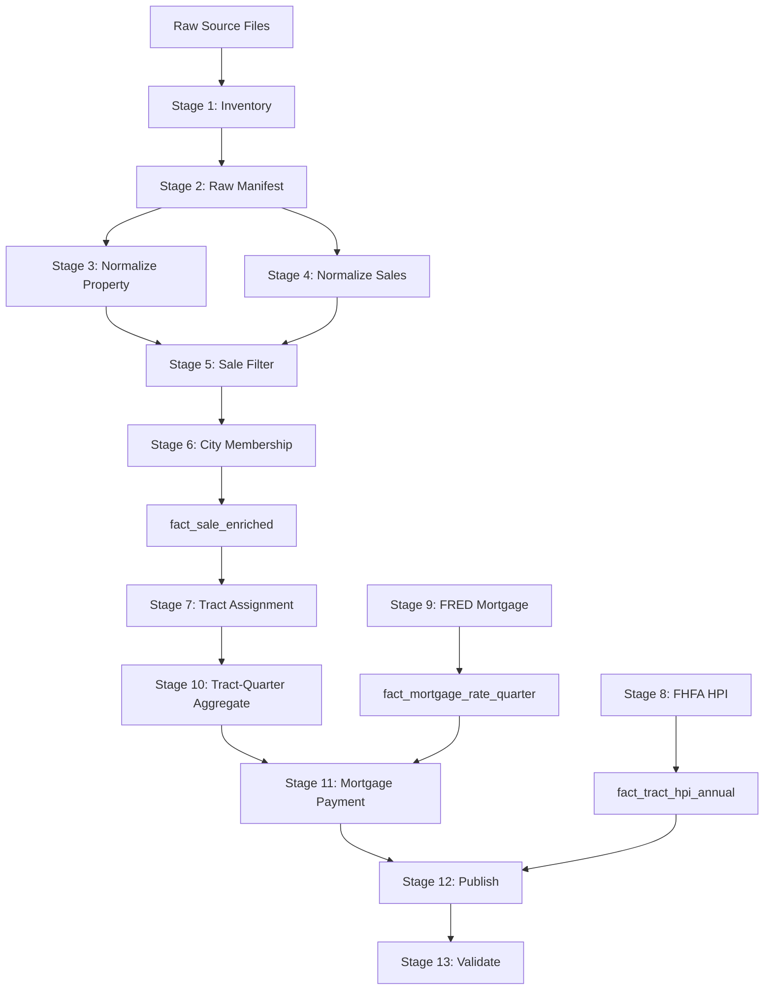

# St. Petersburg Real Estate ETL Pipeline

Reproducible local ETL pipeline producing quarterly, Census-tract-level
housing-market records for parcels inside St. Petersburg, Florida.

## Prerequisites

- Python 3.12
- Virtual environment with dependencies installed

## Setup

```bash
# Create and activate virtual environment
python3 -m venv .venv
source .venv/bin/activate

# Install dependencies
pip install duckdb polars geopandas pyogrio pytest pyarrow pyyaml pyshp openpyxl
```

## Data Requirements

Place the following files in the `data/` directory:

| File | Source |
|------|--------|
| `RP_SALES.csv` | PCPAO sales data (2021+) |
| `RP_PROPERTY_INFO.csv` | PCPAO property info |
| `hpi_at_tract.csv` | FHFA annual tract HPI |
| `MORTGAGE30US.csv` | FRED weekly 30-year mortgage rates |
| `tl_2020_12_tract.*` | 2020 TIGER/Line Florida Census tracts |
| `tl_2020_12_place.*` | 2020 TIGER/Line Florida incorporated places |

Source data files are immutable. The pipeline reads them and writes
transformed output to `output/`.

## Usage

### Complete rebuild (one command)

```bash
python pipeline.py
```

### Run a single stage

```bash
python pipeline.py --stage normalize_sales
python pipeline.py --stage tract_assignment
```

### Skip validation

```bash
python pipeline.py --skip-validation
```

### Run tests

```bash
pytest tests/ -v
```

## Pipeline Architecture



## Output Tables

| Table | Type | Description |
|-------|------|-------------|
| `bronze_source_manifest` | Parquet | Source file inventory with hashes |
| `silver_property_snapshot` | Parquet | All property snapshots |
| `silver_property_current` | Parquet | Current property per STRAP |
| `silver_sales` | Parquet | Cleaned, deduplicated sales |
| `silver_fhfa_tract_hpi_annual` | Parquet | Pinellas FHFA HPI |
| `silver_fred_mortgage_weekly` | Parquet | Weekly mortgage rates |
| `dim_st_petersburg_boundary` | Parquet | City boundary metadata |
| `dim_census_tract` | GeoParquet | Tract geometry + attributes |
| `fact_sale_enriched` | Parquet | Sales with city/tract assignment |
| `fact_mortgage_rate_quarter` | Parquet | Quarterly mortgage rates |
| `fact_tract_hpi_annual` | Parquet | Tract-year HPI values |
| `agg_tract_sale_quarter` | Parquet | Tract-quarter aggregates |
| `dashboard_tract_quarter` | Parquet | Final dashboard table |
| `etl_rejected_records` | Parquet | Rejected sales with reason codes |
| `etl_quality_metrics` | Parquet | Validation check results |
| `pinellas_tracts_dashboard.geojson` | GeoJSON | Web map geometry |

## Configuration

Edit `config.yaml` to adjust:
- Sale filter thresholds and qualification codes
- Property use code inclusion list
- Mortgage payment assumptions (down payment, loan term)
- Small-sample publication threshold (default: 5)
- Coordinate validation bounds
- Geographic vintage selection

## Key Design Decisions

1. **2020 TIGER/Line geometry** — Uses 2020 vintage to match FHFA tract HPI
   boundaries (2020 Census tracts).

2. **Spatial city membership** — Parcels are assigned to St. Petersburg using
   spatial point-in-polygon with the 2020 incorporated-place boundary, not
   tax district fields alone.

3. **Complete tract-quarter spine** — Missing periods appear as null rows
   rather than disappearing, ensuring consistent dashboard layout.

4. **Small-sample flagging** — Tract-quarter cells with fewer than 5 sales
   are flagged rather than deleted (configurable threshold).

5. **Observed timeline** — Quarter-by-quarter median prices begin in 2021
   (start of available PCPAO sales data). FHFA annual HPI is shown
   separately for earlier years.

6. **Immutable source data** — The pipeline never modifies source files in
   `data/`. Lineage fields (`source_file`, `source_row_number`,
   `source_sha256`) are preserved through all stages.

## Assumptions and Limitations

- **PCPAO sales begin 2021**: The pipeline calculates observed quarterly
  median prices only from 2021 onward. FHFA HPI (annual) is available
  from 1975 but measures index values, not observed prices.
- **FRED data partial coverage**: The provided MORTGAGE30US.csv covers
  through January 2024. Later quarters will lack mortgage rate data.
- **2020 boundary applied retroactively**: All sales are classified
  against the 2020 St. Petersburg city boundary, regardless of sale date.
- **Property snapshot date**: Current property attributes (ROLL_YEAR=2026)
  describe the parcel as it exists now, not necessarily as it existed
  on the historical sale date.
- **Single-tract assignment**: Parcels assigned to multiple tracts
  are flagged and de-duplicated to one tract.
- **Payment estimate**: Monthly P&I is an estimate only. It excludes
  taxes, insurance, HOA fees, PMI, closing costs, and maintenance.
