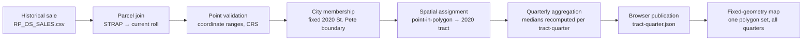

# Historical Geography Methodology

Phase 3 extends the dashboard from 2021 back to 2011-Q1. This document
records how historical sales are placed on the map and why.

## The core decision: one fixed geography

Every sale in the dashboard — 2011 or 2026 — is assigned to **2020 Census
tracts** by the same mechanism:

The tract assignment describes **where the parcel lies in the dashboard's
fixed analytical geography**, not what tract code was administratively
assigned on the sale date. Benefits:

- One continuous map with no boundary jump when the timeline crosses 2020
- One stable tract key (`tract_geoid`, 2020 vintage) for the entire series
- Medians and percentiles **recomputed from parcel-level sales** in the
  target geography — never crosswalked
- Valid appreciation comparisons across all quarters

## Why medians are never crosswalked

The official 2020↔2010 relationship file for Pinellas County contains 398
rows: 177 many-to-many, 80 splits, 36 merges, and only 105 clean one-to-one
relationships. Medians are non-additive — no geographic weight can convert a
2010-tract median into a 2020-tract median. Land-area shares in particular do
not represent the distribution of homes or sales.

The bridge table (`bridge_tract_2010_2020.parquet`) therefore exists as an
**audit and validation layer only**. If a value must ever be allocated across
vintages, only additive measures (counts, sums) qualify, and the weighting
method must be disclosed.

## Geography model fields

| Field | Where | Values |
| --- | --- | --- |
| `geography_method` | parcel-tract assignment, fact table | `direct_point_to_2020_tract`, `unassigned` |
| `tract_boundary_vintage` | dims, assignment | `2020` (dashboard), `2010` (native dim) |
| `tract_assignment_quality_flag` | assignment | `AMBIGUOUS_MULTI_TRACT`, `NO_TRACT_MATCH`, null |
| `fhfa_geography_method` | FHFA fact | `source_tract_code` (never crosswalked) |
| `crosswalk_quality_flag` | bridge | `SLIVER_OVERLAP`, `CROSSES_COUNTY_BOUNDARY`, null |

## City boundary

The study area uses **one fixed St. Petersburg boundary** (2020 TIGER place,
GEOID `1263000`) across the whole series (`cityBoundaryMethod:
fixed_2020_place_boundary` in the publication metadata). Annexation history is
therefore *not* reflected: a parcel annexed in 2015 contributes its pre-2015
sales to the study area as if it had always been inside. This trades
historically contemporaneous membership for a stable study area whose changes
reflect market movement rather than boundary movement.

## The alternative path (not implemented)

A native-geography mode (2011–2019 on 2010 tracts, 2020+ on 2020 tracts) was
specified as a fallback if direct parcel reassignment proved impossible. It
was not needed: parcel linkage is 100% and coordinate coverage is 99.89%, so
the preferred method applies to the entire historical range. The 2010 tract
dimension and bridge remain available if a native display mode is ever added
(see docs/tract-vintage-transition.md).
