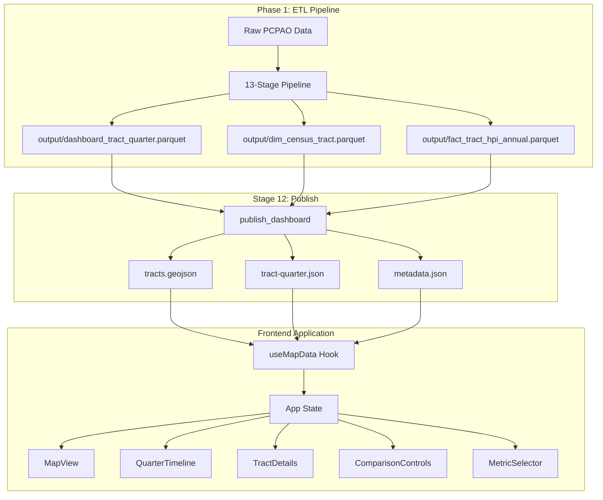

# Map MVP Architecture

## System Overview

The St. Petersburg Real Estate Map MVP is a client-side React single-page application (SPA) that renders an interactive choropleth map of Census tract-level housing market data. Data is produced by a Python ETL pipeline (Phase 1) and served as static JSON/GeoJSON assets.



## Component Tree

```
App
├── ErrorBoundary
│   └── AppShell
│       ├── Map Panel
│       │   ├── MapView (MapLibre GL JS)
│       │   └── MapLegend
│       ├── Details Panel
│       │   ├── MetricSelector
│       │   ├── ComparisonControls
│       │   └── TractDetails
│       │       └── TrendChart (Recharts)
│       └── Timeline
│           └── QuarterTimeline
```

## Data Flow

1. **Pipeline → Static Assets**: Stage 12 filters St. Petersburg tracts (80 tracts) and produces:
   - `tracts.geojson` — GeoJSON FeatureCollection with tract geometry + properties
   - `tract-quarter.json` — Nested `{quarter_id: {tract_geoid: record}}` with all metrics
   - `metadata.json` — Build metadata, assumptions, attributions

2. **Asset Loading**: `useMapData` hook fetches all three files in parallel via `fetch()`

3. **State Management**: `useAppState` maintains centralized state with URL query parameter sync:
   - Selected tract, quarter, metric, comparison mode state
   - `window.history.replaceState` for non-navigating URL updates

4. **Map Rendering**: `MapView` uses MapLibre GL JS with match-expression-based choropleth coloring:
   - Builds a `{tract_geoid: color}` lookup table each quarter/metric change
   - Applies colors via `setPaintProperty('tracts-fill', 'fill-color', matchExpr)`
   - Stadia Maps Alidade Smooth basemap for neutral reference

5. **Classification**: `calculateQuantileBreaks()` computes quintile breaks per-quarter-per-metric. `calculateAppreciationBreaks()` computes diverging breaks for comparison mode.

## Technology Stack

| Layer | Technology | Purpose |
|-------|-----------|---------|
| Build | Vite 8 | Dev server, production bundling |
| UI | React 19 + TypeScript | Component framework |
| Map | MapLibre GL JS 5 | WebGL choropleth rendering |
| Charts | Recharts 2 | Historical trend line chart |
| Testing | Vitest + RTL | Unit & component tests |
| E2E | Playwright | Browser smoke tests |
| Data | Python ETL (Phase 1) | Data production pipeline |

## Key Design Decisions

### Match Expressions over Feature State
MapLibre's `setFeatureState` requires `generateId: true` on the source and individual state updates per feature. Instead, we use `setPaintProperty` with a `['match', ['get', 'tract_geoid'], ...]` expression, building the full color lookup in a single call. This is simpler and more performant for 80 tracts.

### URL Query Parameter State
All interactive state (tract, quarter, metric, comparison mode) is synced to URL query parameters. This enables shareable URLs, browser back/forward navigation, and bookmarking. Invalid parameters are silently ignored with safe defaults.

### Static Asset Approach
No backend server or database is required at runtime. The pipeline produces static JSON/GeoJSON files that are served directly by the web server. This simplifies deployment and eliminates runtime data processing.
